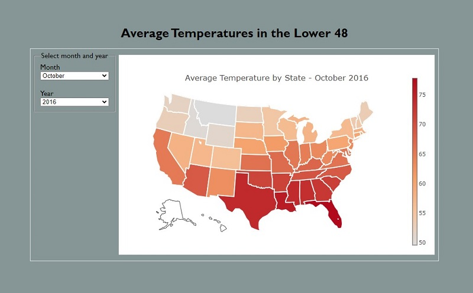

This is a simple, end to end ETL and a full stack interactive dashboard, as an example
to hopefully be of use to students in the UCB/EdX Data Analytics boot camp. 



The original data set is from Kaggle, 

https://www.kaggle.com/datasets/justinrwong/average-monthly-temperature-by-us-state

The ETL Notebook etracts, transforms, and loads the data into a SQLite database. Next, there is a Flask application that serves the web page, and database queries. The front end is then built using HTML, CSS, and JavaScript to provide for user intereactivity.

As the user changes the month and/or year in the dropdown lists, the database is re-queried to obtain the corresponding average temperatures and update the choropleth map of the lower 48 states.

## Use

1) Clone, fork, or download this repo.
2) Pandas and Flask will need to be installed in the environment.
3) Run the app:

```
python app.py
```

4) To begin the Flask server, and visit the page at http://localhost:5000.
5) Have fun! And puruse the code as you wish.
